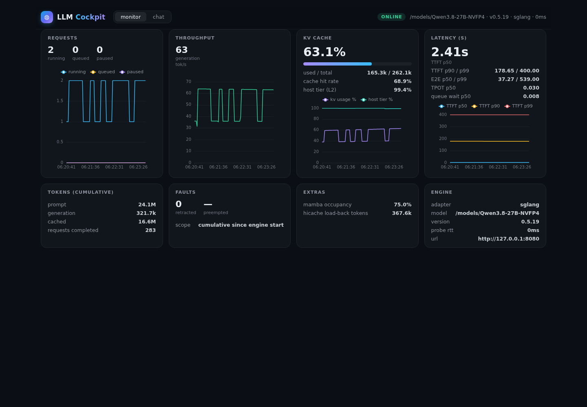
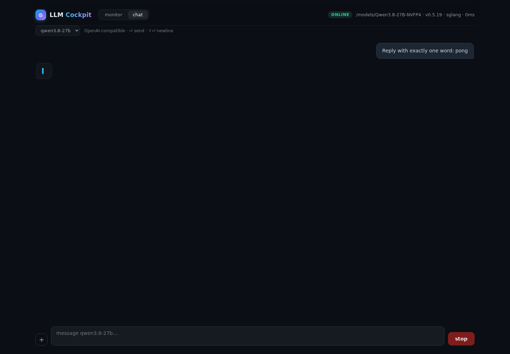
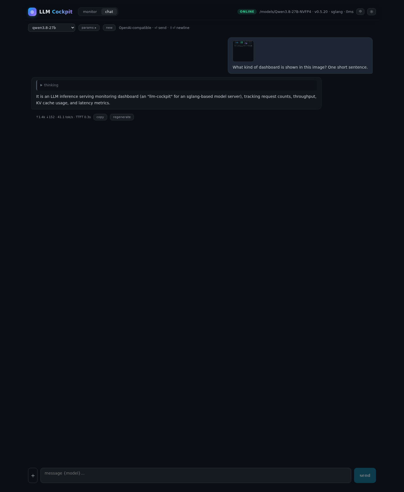

# llm-cockpit

Multi-engine inference console: a live metrics cockpit plus an OpenAI-compatible
chat window, in one process.

**Adapter-driven**: SGLang, vLLM, and any custom engine via declarative mapping
(Prometheus metric names or JSON paths). The UI renders a canonical, engine-agnostic
model — adding a new engine means one small adapter file, not a UI rewrite.

| monitor | chat |
|---|---|
|  |  |

## Quick start

```bash
make run     # self-installing dev server → http://<server-ip>:7777 (binds 0.0.0.0)
make test    # unit tests in a container
make image   # build the runtime image
```

Requirements: Docker only (a `node_modules` docker volume is created on first
use — the host working tree is never written to). You also want a running
inference engine that exposes Prometheus metrics at `/metrics`
(SGLang: start with `--enable-metrics`).

Zero-config: monitors `http://127.0.0.1:8080` with the engine auto-detected
(SGLang `/get_server_info`, vLLM `/version`); chat defaults to that same engine's
`/v1`. Multiple targets, chat providers, custom adapters and the bind address
come from `cockpit.config.yaml` (copy `cockpit.config.example.yaml`).

## The monitor

Capability-driven: every card and chart renders only what the engine actually
exposes (null = engine doesn't report it).

- **requests** — running / queued / paused / swapped, live sparkline
- **throughput** — generation (and prefill) tok/s
- **KV cache** — usage %, used/total tokens, cache hit rate, host-tier (L2/hicache)
  usage when the engine runs a host KV tier
- **latency** — TTFT / E2E / TPOT / queue-wait p50/p90/p99 derived from histograms
- **tokens / faults / extras / engine** — cumulative counters, retractions,
  engine-specific values (e.g. mamba occupancy, hicache load-back tokens)
- **GPU** (auto-detected, Linux): per-device utilization, memory, temperature,
  power with a since-page-load sparkline. In docker, pass `--gpus all` (the
  `make` targets do this automatically when the host has the NVIDIA container
  runtime); without nvidia-smi access the card simply doesn't render.

Optional engine-side flags light up extra rows (no cockpit config needed):
SGLang `--enable-mfu-metrics` adds estimated TFLOPS / memory-bandwidth.

Polling is every 2 s against the server's in-memory ring (15 min window).

## The chat

The chat window talks to any OpenAI-compatible API. Configure **multiple
providers** (`chat.providers` — e.g. the monitored local engine plus DeepSeek
or any gateway); one grouped dropdown picks `provider · model`, and requests
route to the selected provider. Keys stay server-side (`/api/chat/providers`
exposes ids and names only). Streaming responses render markdown with syntax
highlighting; reasoning models get a collapsible "thinking" block. `⏎` sends,
`⇧⏎` inserts a newline, stop aborts in-flight generation. A `params` popover
sets temperature / top_p / max_tokens / system prompt per session, and providers
declaring `thinking_toggle` get a thinking on/off switch (SGLang/Qwen:
`chat_template_kwargs.enable_thinking`). Each answer gets a footnote
(↑prompt ↓completion · tok/s · TTFT · reasoning — individually toggleable) plus
copy and regenerate. The whole chat — messages, attachments, provider/model and
params — persists in browser localStorage and survives reloads; `new` clears
it. The server stores nothing. The proxy injects SSE
keepalive comments every 15 s, so queue/prefill stalls of minutes survive any
socket idle timeout; a 10-minute absolute deadline bounds truly dead upstreams.

**Vision**: the `+` button attaches up to 4 images (original files ≤ 8 MB) to a
message; text and images coexist in one message. Large images are
auto-downscaled in the browser (≤ 1280px per side, JPEG q0.85) before upload — a
4000×3000 phone photo would otherwise expand to 100k+ vision tokens and stall the
engine's prefill for minutes. Images are sent as inline base64 `image_url` content
parts (proxy hard cap: 12 MB, enforced on the socket so chunked bodies cannot
bypass it). The chat model must be vision-capable (e.g. a Qwen-VL serving).



## Custom engines (no code)

Declare a mapping in `cockpit.config.yaml`; values are Prometheus metric names
(`source: prometheus`) or JSON paths (`source: json`, e.g. `$.gpu[0].util`):

```yaml
custom:
  - id: my-engine
    source: prometheus
    url: http://127.0.0.1:8000/metrics
    health: http://127.0.0.1:8000/health
    mapping:
      requests.running: myengine_running
      requests.queued: myengine_waiting
      cache.kvUsagePct: myengine_kv_usage
      counts.requestsCompletedTotal: myengine_completed
      latency.ttft: myengine_ttft      # histogram base name
      extras.custom_metric: myengine_extra
    static:
      engine.model: my-model
targets:
  - id: mine
    url: http://127.0.0.1:8000
    custom: my-engine
```

Validate a mapping live (syntax check + fetch the endpoint + report which mapped
metrics are missing): `POST /api/validate-mapping`.

## HTTP API

| Route | Description |
|---|---|
| `GET /api/health` | liveness + target count |
| `GET /api/targets` | targets with adapter, status, model, version |
| `GET /api/snapshot?target=id` | latest normalized snapshot |
| `GET /api/history?target=id&sec=600` | rolling ring (≤ 15 min @ 2 s); `&compact=1` → chart scalars only |
| `POST /api/validate-mapping` | validate a custom adapter + live probe |
| `GET /api/chat/providers` | configured chat providers (ids/names only, no keys) |
| `GET /api/chat/models?provider=id` | model list from one provider (omitted = default) |
| `POST /api/chat/stream?provider=id` | SSE proxy → OpenAI `chat/completions` (stream, ≤12 MB body) |

All numeric fields in the canonical model are nullable — the shape is stable
across engines; capabilities (`mamba`, `hicache`, `prefixCache`) tell the UI
what exists.

## Layout

```
src/core/      canonical model, prometheus parser, quantile/rate derivation, ring buffer
src/adapters/  sglang, vllm, custom (declarative), registry + auto-detect
src/chat/      OpenAI-compatible connector
web/           React 19 + ECharts frontend (bundled by scripts/build.ts)
test/          unit tests + engine fixtures
```

## Development

The whole toolchain runs in containers; the host stays clean (dependencies live
in the `cockpit_mod` docker volume, build output in `cockpit_dist` — the working
tree is never written to). `make typecheck` / `make lint` / `make test` wrap the
container equivalents. `bun run scripts/build.ts` bundles the server (target
bun, zero runtime deps) and the web app (browser, content-hashed asset name).
`make binary` exports `../cockpit-dist/` containing the compiled `llm-cockpit`
executable **plus its sibling `web/` asset folder** — run it from that directory
(the UI needs those assets at runtime; the API works without them).
Browser QA harness and conventions: see [CONTRIBUTING.md](CONTRIBUTING.md).

Remote/high-latency access (e.g. an SSH tunnel): every response is
brotli/gzip-negotiated (static assets pre-compressed at build time, API
payloads at serve time), the UI bundle carries a content hash in its filename
and is cached `immutable` — first load ~0.6 MB, reloads fetch only the 12 KB
page and the compact chart deltas (~20 KB brotli per 2 s poll).

## Security

**LLM Cockpit ships with no authentication** — by design it is a single-operator
console for a trusted network, bound to `0.0.0.0` so you can reach it from your
laptop. Anyone (or anything) that can open the port can read your engine's
metrics and spend GPU time through the chat proxy, and `POST /api/validate-mapping`
will fetch URLs you give it. Keep it on a trusted LAN or VPN; firewall the port
otherwise; set `server.host: 127.0.0.1` (plus a reverse proxy with auth) for
anything stricter.

## Limitations

- Gauge/percentage metrics that are reported per data-parallel rank show the
  first series in multi-rank (DP>1) deployments; counters are summed across all
  label splits.
- Images in chat history are re-sent with every follow-up turn (standard
  OpenAI multimodal semantics) — long image-heavy conversations cost vision
  tokens each turn; start a new conversation to reset.

## 中文说明

llm-cockpit 是一个多引擎推理控制台:一个进程里同时提供**实时指标监控**和
**OpenAI 兼容对话**两个界面。

- **适配器驱动**:内置 SGLang / vLLM 适配器,任意自研引擎通过声明式 YAML
  映射(Prometheus 指标名或 JSON 路径)接入,无需写代码。
- **规范模型**:所有引擎的指标被归一化为同一套结构(请求数、吞吐、KV 缓存、
  延迟直方图 p50/p90/p99、故障计数、extras),UI 只渲染引擎真实上报的字段
  (能力驱动,缺失即隐藏)。
- **GPU 面板**(自动探测):利用率、显存、温度、功耗 + 页面存续期迷你曲线;
  docker 部署时 `--gpus all` 即可(`make` 目标在宿主机具备 NVIDIA 容器运行时
  时自动附加),无 nvidia-smi 时整卡隐藏。
- **对话窗口**:可配置**多个 provider**(`chat.providers`,如下拉中的
  "DeepSeek · deepseek-flash";监控后端天然是默认 provider,api_key 只留在
  服务端),代理到任意 OpenAI-compatible API,支持 SSE 流式、reasoning
  模型 thinking 折叠、markdown + 代码高亮、随时停止;`+` 按钮可附加图片
  (每条最多 4 张、单张原始文件 ≤8MB,浏览器端自动压到 ≤1280px JPEG 再上传——
  原图直发会膨胀成十几万 token 把引擎卡死;需视觉模型支持)。文字与图片可在
  同一条消息中共存。`params` 浮层按会话设置 temperature / top_p / max_tokens /
  system prompt,声明了 `thinking_toggle` 的 provider 带思考开关;每条回复带脚注
  (↑prompt ↓completion · tok/s · TTFT · reasoning,可勾选)与复制/重新生成。整个
  对话(消息、附件、provider/模型、参数)经浏览器 localStorage 持久化,刷新不丢,
  `new` 清空;服务端不落盘任何对话数据。
- **容器化工具链**:`make run / test / typecheck / lint / image / binary`
  全部在容器内执行,不污染宿主机(依赖在 `cockpit_mod` 卷、构建产物在
  `cockpit_dist` 卷,工作树不被写入;`make binary` 导出到 `../cockpit-dist/`)。
- **安全**:控制台**不含任何鉴权**,默认监听 `0.0.0.0` 便于无头服务器远程访问。
  能访问该端口者都能读取引擎指标、通过对话消耗 GPU,并让 `validate-mapping`
  去请求其指定的 URL。请务必置于可信内网/VPN 并防火墙该端口;更严格的部署可设
  `server.host: 127.0.0.1` 再配合带鉴权的反向代理。

快速开始:`make run` → 打开 `http://<服务器IP>:7777`(默认监听 `0.0.0.0`,
适配无头服务器;默认监控本机 8080 的 SGLang,自动探测引擎;SGLang 需
`--enable-metrics` 启动。如需仅本机访问,配置里把 `server.host` 改回
`127.0.0.1`)。

## License

Copyright 2026 mikecovlee — Apache-2.0, see [LICENSE](LICENSE).
